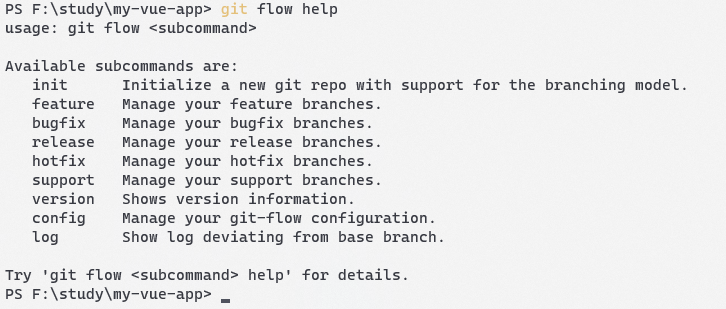

## 1. 工作流规范

### 1.1 版本规范

详情参阅[语义化版本](https://semver.org/lang/zh-CN/)规范。

### 1.2 使用 git-flow 进行版本控制

推荐使用 [git-flow](https://www.git-tower.com/learn/git/ebook/cn/command-line/advanced-topics/git-flow) 管理流程，当然也可以根据实际情况制定自己的流程，但是先把人家的研究透了之后再自定义。

git-flow 貌似是集成在了 git 里面，所以只需要安装好 git 就行，

git-flow 预设两个分支：

- master： mater 分支是最终的发行版分支，开发的代码不能直接合并到此分支。如果涉及到线上的 bug，从此分支分离新的修 bug的分支。
- develop： develop 分支是各项功能的基础分支，新功能开发完毕后先合并到此分支，测试通过之后在合并到 master 分支。

下面是一些主要命令：

```bash
# 初始化项目，直接 enter 选择默认值就行
git flow init

# 开发新功能（创建新分支）
git flow feature start new-feature

# 开发完成
git flow feature finish new-feature

# 创建 release
git flow release start 0.1.1

# 最后的修改之后，发布 release
git flow release finish 0.1.1

# 创建 bugfix 分支
git flow bugfix start 20279

# 修改完成
git flow bugfix finish 20279

# 创建修复线上 bug 分支
git flow hotfix start 20280

# 完成修复
git flow hotfix finish 20280
```

其他的命令可以运行 `git flow help` 查看。



**在 release 完成之后，提交 develop 的代码，然后 merge 到 master 分支上**

### 1.3 提交信息规范

良好的提交信息可以提升项目的整体质量。

- **格式统一的提交信息有助于自动化生成CHANGELOG**
- **版本库不只是存放代码的仓库, 它记录项目的开发日志, 它应该要清晰表达这次提交的做了什么.** 这些记录应该可以帮助后来者快速地学习和回顾代码, 也应该方便其他协作者review你的代码
- **规范化提交信息可以促进提交者提交有意义的、粒度合适的'提交'.** 提交者要想好要怎么描述这个提交，这样被动促进了他们去把控**提交的粒度**

#### 提交信息格式

一般选择 [angular 的提交规范](https://github.com/angular/angular/blob/master/CONTRIBUTING.md#commit)。

```text
<type>(<scope>): <subject>

<body>

<footer>
```

可以直接看这个人的[描述](https://github.com/GDJiaMi/frontend-standards/blob/master/development.md#header)。

推荐使用插件协助编写提交信息：

- vscode 推荐 [git-commit-plugin](https://marketplace.visualstudio.com/items?itemName=redjue.git-commit-plugin)，无他，中文而且带 emoji
- JetBrains 全家桶可以用 [Git Commit Template](https://plugins.jetbrains.com/plugin/9861-git-commit-template)

### todo

#### 测试

#### 集成

## 2. 项目组织规范

### 2.1 构建项目规范

目前最好是使用官方的工具构建，比如 `vue-cli` 和 `crete-react-app`，专业的事情交给专业的做，如果将来有能力，可以基于这些开发自己的构建工具。

### 2.1 通用的项目规范

一个典型的项目组织规范如下:

- README.md 项目说明，必须
- CHANGELOG.md 放置每个版本的变更内容
- package.json  前端包管理信息
- .gitignore    忽略不必要文件，避免被提交到版本库
- 。gitattributes   git 配置
- docs/ 存放文档的地方，可选
- examples/ 项目示例代码，一般开源项目才有
- build/    可选
- dist/ 打包结果文件夹
- src/  源代码文件夹
- tests/    在根目录表示全局测试，通常放应用的集成测试或E2E测试等用例；模块的测试应该在模块下面建`tests/`文件夹
- .env.*    环境变量文件

### 2.2 目录组织规范

#### 文件命名规范

参考阮一峰[中文技术文档写作规范](https://github.com/ruanyf/document-style-guide/blob/master/docs/structure.md#文件名)。

1. 文档文件名不得含有空格
2. 最好不要使用中文
3. 建议只用小写字母，除某些特殊文件
4. 分割单词用`-`连词符号

#### 页面组织

每个页面单独建立文件夹，通过`index.js`引入，页面自己的组件放在当前文件夹的`components`文件夹下，公用组件放在`src/components`文件夹。

```txt
src/
    components/
    page/
        page1/
            components/
                component1.vue
                component2.vue
            index.js

```

### 2.3 脚手架和项目模板

在将项目结构规范确定下来后，可以创建自己的脚手架工具或者项目模板，用于快速初始化一个项目或代码模板。

## 3. 技术栈规范

> 三大框架跟编程语言一样都有自己的设计哲学，这跟库是不一样, 一个库的替换成本很低；而框架的背后是一个架构、一个生态。每个框架背后牵涉着开发思维、生态系统、配套工具、最佳实践、性能调优。要精通和熟练一个框架需要付出的成本是很高。

**所以说团队的开发效率是基于稳定且熟练的技术栈的**。稳定的技术栈规范有利于团队协作和沟通；另外如果团队精通这个技术栈，当出现问题或者需要深入调优，会相对轻松。

直接参考这位[老兄的规范](https://github.com/GDJiaMi/frontend-standards/blob/master/tech-stack.md)，主要包括下面几个。

### 语言

我还是比较倾向于使用 Javascript。Typescript 可以在用 Vue3 或者 React 的时候使用。

### 框架

- ✅ Vue2.x
- 生态
- 路由 vue-router
- 状态管理 vuex
- UI框架  element-ui
- 图标    iconfont
- http库  axios
- 数据可视化  echart

### CSS

- 命名规范
- [BEM](http://getbem.com/naming/) 感觉能看懂就行了
- 框架
- 原生 CSS 我更倾向这个
- less
- scss

### QA

- 测试 jest
- ESLint
- 代码格式化 prettier

### 构建

- webpack
- vue-cli

### 项目管理

- yarn
- npm

### 开发工具

- webstorm
- vscode

### utils

- lodash

### 版本管理

- git

### 持续集成

## 4. 编码规范

> 统一的编码规范对团队项目的长远维护不无裨益. 一致性的代码规范可以增强团队开发协作效率、提高代码质量、减少遗留系统维护的负担。

使用lint工具去约束编码行为。

### 4.1 Javascript

- Lint 工具， 使用 [ESLint](https://cn.eslint.org/)
- [JavaScript Standard Style](https://standardjs.com/readme-zhcn.html#why-should-i-use-javascript-standard-style) 规范或者 [Airbnb JavaScript Style Guide](https://github.com/airbnb/javascript)
- 类型检查 TypeScript

### 4.2 HTML

无他，多使用语义化标签。还是有一个[文档](https://codeguide.co/)。

### 4.3 CSS

### 4.4 代码格式化

使用 [Prettier](https://prettier.io/) 对格式化代码。

### 4.5 抄作业

- [isobar 前端代码规范及最佳实践](https://coderlmn.github.io/code-standards/#_html5)
- [凹凸实验室代码规范](https://guide.aotu.io/index.html)
- [百度FEX规范](https://github.com/fex-team/styleguide)

### 4.6 code review


Code Review有很多好处，比如：

- **Code Review可以让其他成员都熟悉代码**。这样保证其他人都可以较快地接手你的工作，或者帮你解决某些问题
- **提高代码质量**。毫无疑问. 一方面是主动性的代码质量提升，比如你的代码需要被人Review，会自觉尽量的提高代码质量；另一方面，其他成员可以检查提交方的代码质量
- **检查或提高新成员的编程水平**。培养新人时，由于不信任它们提交的代码，我们会做一次Review检查代码是否过关。另一方面这是一次真实的案例讲解, 可以较快提高

如果可能的话，推荐每个月（或者更短）抽出一点时间，大家一起 code review，相互学习。

## 5. 文档规范

> 如果有规范的文档体系，转交工作就会变动非常轻松。

文档对于项目开发和维护、学习、重构、以及知识管理非常重要。就拿 hydra 来说，之前都是听 aki 说，需求我们其实都不是很清楚，现在 aki 走了，很多东西还是要去通过代码实现才知道是干啥子的。

广义的文档不单指‘说明文件’本身，它有很多形式、来源和载体，可以描述一个知识、以及知识形成和迭代的过程。例如版本库代码提交记录、代码注释、决策和讨论记录、CHANGELOG、示例代码、规范、传统文档等等

### 5.1 建立文档中心

我们可以在 ADO 上建立一个 git 仓库来存放我们的文档。目录结构可以致敬别人的：

```text
规范/
A应用/
  产品/
  设计/
  API文档/
  测试/
  其他/
B应用/
```

文档推荐使用 `markdown` 文件，因为可以直接在网页上浏览。特殊情况，还是怎么适合怎么来。

### 5.2 文档格式

毫无疑问，对于开发者来说，[Markdown](https://zh.wikipedia.org/wiki/Markdown) 是最适合的、最通用的文档格式。支持版本库在线预览和变更历史跟踪。

工具：

- [typora](https://typora.io/) 跨平台的 markdown 编辑器
- vscode 可以搭配插件使用
- Markdown All in One
- Markdown Preview Enhanced 我现在就是用的这个

文档的格式可以参考阮一峰的[中文文档规范](https://github.com/ruanyf/document-style-guide/blob/master/docs/reference.md)。

### 5.3 讨论即文档

可以尝试将一些有意义的话题从 IM 迁移到 Issue：

- 设计方案
- 决策/建议
- 新功能、新技术引入
- 重构
- 性能优化
- 规范
- 问题讨论
- 重大事件
- 计划或进度追踪

Issue 的许多妙用，可以看这篇文章[如何使用 Issue 管理软件项目](http://www.ruanyifeng.com/blog/2017/08/issue.html)。

Issue 通常通过标签来进行分类，方便组织和检索：


### 5.4 注释即文档

> 必要和适量的注释对阅读源代码的人来说就是一个路牌, 可以少走很多弯路

关于注释的一些准则，[<阿里巴巴Java开发手册>](https://github.com/alibaba/p3c/blob/master/p3c-gitbook/%E7%BC%96%E7%A8%8B%E8%A7%84%E7%BA%A6/%E6%B3%A8%E9%87%8A%E8%A7%84%E7%BA%A6.md)总结得非常好, 推荐基于这个来建立注释规范。另外通过ESlint是可以对注释进行一定程度的规范。

### 5.5 代码即文档

## 6. UI 设计规范

为什么要定义 UI 设计规范，首先可以实现组件的复用，只需要简单的改变颜色。不用写很多定制化的组件，浪费时间。其次，可以统一系统的色彩基调，如果将来有更换主题的需求，可以快速实现。

良好的 UI 规范可以参考[这个案例](https://i.loli.net/2018/06/21/5b2b5317f1271.png)。也可以直接借鉴 [ant-design](https://ant.design/docs/spec/colors-cn) 的规范。

## 7. 测试规范

### 7.1 单元测试

使用 jest 进行单元测试

TODO...

## 8. 异常处理、监控和调试规范

合理有效的异常处理可以提高应用的健壮性，保证页面的正常使用，可以帮助开发者快速定位异常。

### 8.1 异常处理

可以参考<阿里巴巴的java开发手册>中总结的[异常处理规范](https://github.com/alibaba/p3c/blob/master/p3c-gitbook/%E5%BC%82%E5%B8%B8%E6%97%A5%E5%BF%97/%E5%BC%82%E5%B8%B8%E5%A4%84%E7%90%86.md)。

### 8.2 日志处理

通常只保留必要的、有意义的日志信息。

- 避免重复打印日志
- 谨慎地记录日志, 划分日志级别。比如生产环境禁止输出debug日志；有选择地输出info日志；
- 使用前缀对日志进行分类, 例如: [User] xxxx
- 只记录关键信息, 这些信息可以帮助你诊断问题

### 8.3 异常监控

因为程序跑在不受控的环境，所以对于客户端应用来说，异常监控在生产环境是非常重要的，它可以收集各种意料之外生产环境问题，帮助开发者快速定位异常。

和日志一样，**不是所有‘异常’都应该上报给异常监控系统**，譬如一些预料之内的‘异常’，比如用户输入错误、鉴权失败、网络错误等等。**异常监控主要用来上报一些意料之外的、或者致命性的异常**。

呐呐呐呐呐呐呐呐呐呐呐呐呐呐，没有精力就用 [Sentry](https://sentry.io/welcome/) 工具监控。

## 9. 前后端协作规范

### 9.1 协作流程规范

一个典型的前后端协作流程如下：


1. 需求分析。参与者一般有前后端、测试、以及产品. 由产品主持，对需求进行宣贯，接受开发和测试的反馈，确保大家对需求有一致的认知
2. 前后端开发讨论。讨论应用的一些开发设计，沟通技术点、难点、以及分工问题.
3. 设计接口文档。可以由前后端一起设计；或者由后端设计、前端确认是否符合要求
4. 并行开发。前后端并行开发，在这个阶段，前端可以先实现静态页面；或者根据接口文档对接口进行Mock，来模拟对接后端接口
5. 在联调之前，要求后端做好接口测试
6. 真实环境联调。前端将接口请求代理到后端服务，进行真实环境联调

### 9.2 接口规范

选择通用的、有标准定义接口形式。例如：

- [RESTful](https://zh.wikipedia.org/zh-hans/%E8%A1%A8%E7%8E%B0%E5%B1%82%E7%8A%B6%E6%80%81%E8%BD%AC%E6%8D%A2) 目前最为广泛的API设计规范，基于HTTP本身的机制实现
- [JSONRPC](http://wiki.geekdream.com/Specification/json-rpc_2.0.html) 不知道这是个啥
- [GraphQL](https://graphql.org/learn/) 据说是未来，这个项目就是用的GraphQL

接口设计需要注意的点：

- 明确区分是正常还是异常, 严格遵循接口的异常原语. 上述接口形式都有明确的异常原语，比如JSONRPC，当出现异常时应该返回错误对象响应，而不是在正常的响应体中返回错误代码. 另外要规范化的错误码, HTTP响应码就是一个不错的学习对象
- 明确数据类型。很多后端写的接口都是string和number不分的，如果妥协的话、前端就需要针对这个属性做特殊处理，这也可能是潜在的bug
- 明确空值的意义。比如在做更新操作是，空值是表示重置，还是忽略更新？
- 响应避免冗余的嵌套。
- 接口版本化，保持向下兼容。就像我们上文的‘语义化版本规范’说的，对于后端来说，API就是公共的接口. 公共暴露的接口应该有一个版本号，来说明当前描述的接口做了什么变动，是否向下兼容。
- 现在前端代码可能会在客户端被缓存，例如小程序。如果后端做了break change，就会影响这部分用户。

### 9.3 接口文档

可以使用[swagger](https://swagger.io/specification/)来管理接口，但是是否需要先定义需要的数据和所属字段的类型。

### 9.4 接口测试与模拟

为了做到高效率的前后端并行开发，接口的测试与模拟是必要的。

- 前端要求后端在联调之前，需要测试验证好自己的接口是否可以正常工作。而不是在联调期间，把前端当‘接口测试员’，阻塞接口联调进度
- 另外前端需要在后端接口未准备好之前，通过接口模拟的方式，来编写业务逻辑代码。

针对接口测试与模拟，存在下图这样一个理想的模型:


一切从定义良好的接口文档出发，生成Mock Server和Mock Client, Mock Server给前端提供模拟数据，而Mock Client则辅助后端对它们的接口进行测试。

资源：

- RESTful
    - swagger
    - [JSON Server](https://github.com/typicode/json-server) 这个还行吧，自己写json数据 
    - Easy Mock 可视化的、在线的接口mock工具
- GraphQL
    - GraphQL Faker
    - graphql-tools
- 模拟数据生成
    - [faker.js](https://github.com/faker-js/faker) 数据太过于通用，或许我们可以自己搞一个
    - [Mock.js](https://link.juejin.cn/?target=https%3A%2F%2Fgithub.com%2Fnuysoft%2FMock) 我连mock是个啥子都没搞懂

## 10. 培训/知识管理/技术沉淀

### 10.1 培训

todo...

### 10.2 营造技术氛围

- **鼓励成员写技术博客，或者建立自己的团队专栏** 所以我创建这个项目，每个人都可以把玩
- **鼓励参与开源项目**
- **建立面试题库** 让我们快乐的刷题吧
- **定期的专题分享**

#### 专题怎么来?

    - 专题请求. 可以请求其他成员完成专题，比如比较深的知识，可以要求团队比较有经验的进行学习分享
    - 学习总结.
    - 项目回顾
    - 难点攻克
    - 项目规范
    - 工具使用

- **落实和完善开发规范** 规范本身就是团队知识沉淀的一种
- **图书分享** 得看呀
- **鼓励重构和持续优化代码**
- **抽象一套基础库或框架，减少重复工作，提高工作效率** 比如公共的组件，还有现在的pdf导出

## 参考

99% 照搬掘金[if 我是前端团队 Leader，怎么制定前端协作规范?](https://juejin.cn/post/6844903897610321934#)